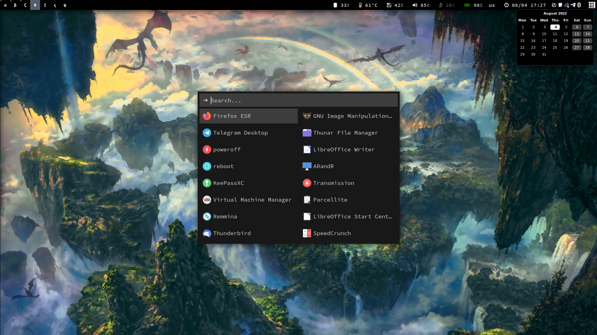
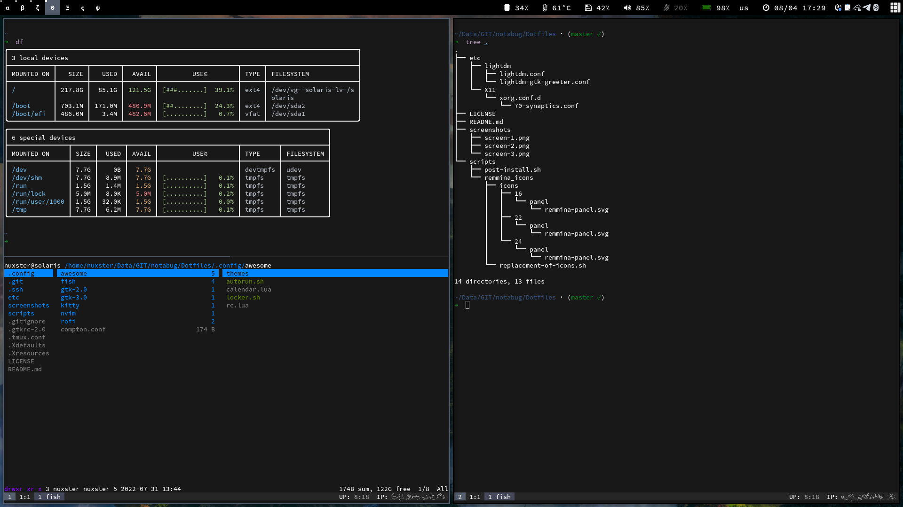
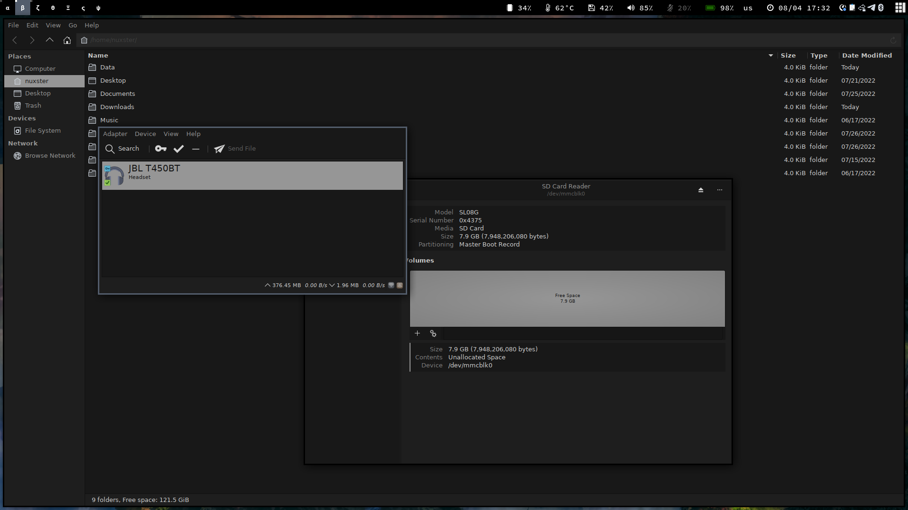

# Awesome (DEPRECATED)







# Debian installation
1. To install use the latest build of Debian 12;
2. Perform a minimal installation, uncheck all components;

# Run post-install script
```shell
sudo apt update
sudo apt install git ca-certificates --no-install-recommends -y
git clone https://github.com/nuxster/my-dotfiles.git
cd my-dotfiles
git switch Awesome
sudo ./scripts/post-install.sh $USERNAME
```

# Ranger
```shell
ranger --copy-config=all
vim /home/$USERNAME/.config/ranger/rc.conf

set preview_script ~/.config/ranger/scope.sh
set preview_images true
set preview_images_method w3m
set colorscheme solarized
```
